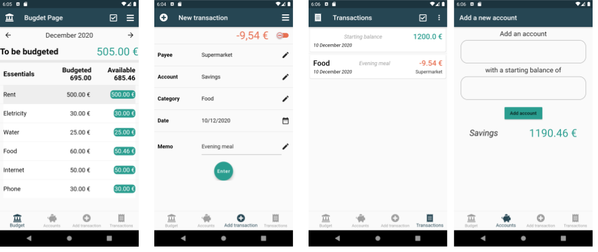

# Your Budget - Personal budgeting software

Your Budget is a cross-platform application coded thanks to the Google [Flutter](https://flutter.dev/) framework.

## Contributing

The top level directory structure follows the standard Flutter project directory structure.

We try to adhere as much as possible to the [GitFlow branching model](https://www.atlassian.com/git/tutorials/comparing-workflows/gitflow-workflow).

## Screenshots

